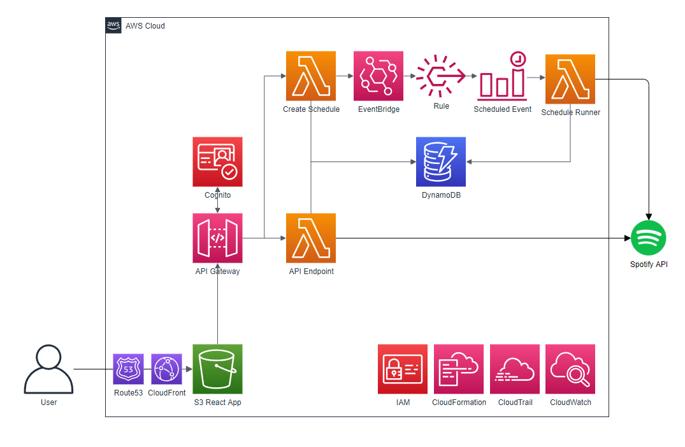

# Amplified.tools API

This Serverless Framework repository is for a homebrew project, [amplified.tools](https://www.amplified.tools), to provide more powerful, automated ways of interacting with your Spotify playlists.

## Development

### Pre-requisites
1. [Setup AWS CLI and profile](https://www.serverless.com/framework/docs/providers/aws/guide/credentials) 

### Setup

1. Create a new `.env` file based on [.env.example](./.env.example)
    - [Spotify App Credentials](https://developer.spotify.com/dashboard/applications) are required
        - SPOTIFY_CLIENT_ID
        - SPOTIFY_CLIENT_SECRET

Run `npm start` to launch the serverless offline at [http://localhost:3000](http://localhost:3000)

## Deployment

Run `npm run deploy` to build and deploy the generated CloudFormation stack.

Run `npm run validate` to build and validate the generated CloudFormation stack.

## Serverless Framework

This project uses the [Serverless Framework](https://github.com/serverless/serverless). You can learn more at [serverless.com](https://www.serverless.com/).
